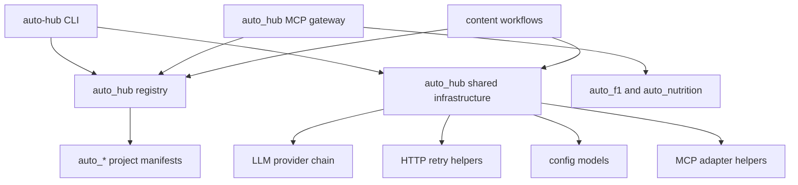

# auto_hub Integration Plan

Status: draft, supplemented
Created: 2026-06-05
Last updated: 2026-06-05
Workspace: `/Users/hainingyu/Code`

## 1. Purpose

`auto_hub` is the central coordination layer for the existing `auto_*` projects.
It should make the tools easier to discover, configure, and compose without
turning the whole workspace into one tightly coupled application.

The first version should be conservative:

- Do not move existing `auto_*` projects.
- Do not break their independent Git repositories.
- Do not rewrite business logic just to make things look uniform.
- Extract only shared infrastructure that is already duplicated across projects.
- Add a central registry so humans and agents can understand what each tool does.

In short: `auto_hub` is a hub, not a forced monorepo.

## 2. Existing Constraints

The root workspace rules in `CLAUDE.md` matter for this plan:

- Package management should use `uv`.
- The workspace is a container repo.
- Subprojects are independent Git repositories.
- Changes should be surgical.
- Python code should use type hints.
- API calls and file operations should have explicit error handling.
- Credentials such as `.env`, `secrets.json`, and `cookies.json` must not be read or modified.
- Cross-project refactors should only happen when explicitly requested.

Because of those constraints, `auto_hub` should integrate through stable
interfaces and manifests, not by physically merging all codebases.

## 3. Current Project Inventory

| Project | Current Shape | Main Capability | Suggested First Integration |
| --- | --- | --- | --- |
| `auto_animation` | Static HTML/CSS/JS collection | Animation gallery | Registry only |
| `auto_audiobook` | Python CLI package | TTS, voice cloning, audiobook pipeline | Registry; later use its pipeline patterns as input for the job runner design |
| `auto_curation` | Python CLI/web-ish scraper | Art institution data collection and LLM extraction | Shared LLM provider chain |
| `auto_f1` | MCP server | F1 live/historical data and reports | Registry, MCP aggregation |
| `auto_form` | Python CLI/web automation | Form generation/submission automation | Registry only |
| `auto_github` | Python CLI using `requirements.txt` | GitHub trending curation | Shared LLM client, later packaging cleanup |
| `auto_html` | Python package + web app | Markdown to HTML and AI images | Shared LLM/image client |
| `auto_lingo` | Python package + web app | Translation, Whisper, OCR | Shared LLM client, later MCP adapter |
| `auto_motion` | Python CLI package | Image/video generation | Registry, later media API adapter |
| `auto_nutrition` | MCP server | MyFitnessPal nutrition logging | Registry, MCP aggregation |
| `auto_pdf` | Python package + web app | PDF conversion, translation, summary | First shared LLM migration candidate |
| `auto_resume` | Markdown/PDF assets + small script | Resume generation/assets | Registry only |
| `auto_scrape` | Python CLI package | Research/scraping with AI config generation | Source candidate for shared LLM provider chain |

## 4. Goals

### 4.1 Short-Term Goals

1. Create a central project registry.
2. Define a stable manifest format for each `auto_*` project.
3. Extract a reusable LLM provider layer from duplicated implementations.
4. Let projects adopt shared code one at a time.
5. Keep each project independently runnable and testable.

### 4.2 Medium-Term Goals

1. Add a unified CLI for discovery and status checks.
2. Add MCP aggregation for projects that expose agent-friendly tools.
3. Standardize environment variable names and model configuration.
4. Add compatibility adapters for projects that cannot migrate immediately.

### 4.3 Long-Term Goals

1. Compose projects into content production workflows.
2. Add a job runner with retries and resumable artifacts.
3. Standardize intermediate outputs across document, language, media, and publishing tools.
4. Provide one documented entry point for AI clients and local automation.
5. Provide copyable MCP configuration snippets for local AI clients.

## 5. Non-Goals

These are intentionally out of scope for the first phase:

- Moving all projects into `auto_hub/`.
- Converting the workspace into a single monorepo.
- Replacing every CLI with one large application.
- Rewriting all projects to share the same framework.
- Automatically changing `.env` files or credentials.
- Adding MCP wrappers before the core interfaces are clear.
- Reformatting unrelated files.
- Building a custom JSON-RPC implementation when the existing MCP Python SDK is sufficient.
- Forcing all projects to expose every capability through MCP.

## 6. Target Architecture

`auto_hub` should eventually have three layers:

1. Registry layer: knows what tools exist, where they live, how to run them, and what they need.
2. Shared infrastructure layer: reusable clients and utilities for LLM, HTTP, config, logging, and MCP.
3. Composition layer: optional workflows that call individual tools through their public interfaces.



## 7. Proposed Directory Structure

Initial minimal structure:

```text
auto_hub/
  PLAN.md
```

Recommended next structure:

```text
auto_hub/
  .gitignore
  CLAUDE.md
  README.md
  README.zh-CN.md
  PLAN.md
  pyproject.toml
  docs/
    audits/
      llm_implementations.md
    clients/
      claude_desktop.md
      cursor.md
  manifests/
    projects.yaml
  src/
    auto_hub/
      __init__.py
      cli.py
      registry/
        __init__.py
        models.py
        loader.py
      llm/
        __init__.py
        models.py
        provider_chain.py
        json.py
        stats.py
      config/
        __init__.py
        env.py
      http/
        __init__.py
        retry.py
      mcp/
        __init__.py
        gateway.py
  tests/
    test_registry.py
    test_llm_provider_chain.py
```

This structure keeps `auto_hub` small but gives it enough shape to grow safely.

## 7.1 Local Project Rules

`auto_hub` should have its own `CLAUDE.md` because it is an independent
subproject. That file should be short and stricter than the root file:

- Use `uv` for all Python dependency and command execution.
- Use `src/auto_hub` package layout.
- Use snake_case for Python modules, YAML keys, and capability IDs.
- Keep public CLI commands kebab-case, for example `auto-hub list`.
- Do not read or modify `.env`, `secrets.json`, or `cookies.json`.
- Default tests must be offline and must not require API keys.
- Do not import code from sibling `auto_*` projects in registry loading.
- Prefer typed Pydantic models at manifest and config seams.
- Keep adapters thin; project-specific prompts and business logic stay in the owning project.

## 8. Phase Plan

## Phase 0: Establish `auto_hub`

Objective: create the hub as an independent project shell.

Tasks:

- Treat `auto_hub` as a first-class independent subproject under `/Users/hainingyu/Code`.
- Initialize `auto_hub` as its own Git repository.
- Add `.gitignore` with at least `.venv/`, `__pycache__/`, `.pytest_cache/`, `.ruff_cache/`, `dist/`, `build/`, `*.egg-info/`, and local runtime logs.
- Add local `CLAUDE.md` with the rules from section 7.1.
- Add `README.md` explaining that `auto_hub` is a coordination layer.
- Add `README.zh-CN.md` with the same positioning in Chinese.
- Add `pyproject.toml` using `uv`.
- Add package directory under `src/auto_hub`.
- Add a minimal `auto-hub` CLI entry point.
- Add tests directory.
- Add a smoke test for the CLI.
- Do not add sibling projects as dependencies in this phase.

Acceptance criteria:

- `uv run auto-hub --help` works.
- `uv run pytest` works, even if only smoke tests exist.
- No existing `auto_*` project is modified.
- `git -C auto_hub status --short` works and shows only `auto_hub` files.
- Root `git status` remains unaffected by `auto_hub` because the container repo ignores first-level subproject directories.

## Phase 0.5: LLM Implementation Audit

Objective: compare existing LLM implementations before designing the shared LLM module.

This phase prevents `auto_hub.llm` from being shaped by assumptions. The audit
should read source files only and must not read `.env` or any secret-bearing
files.

Candidate files:

| Project | File | Audit Focus |
| --- | --- | --- |
| `auto_scrape` | `src/scrape_lego/ai/provider.py` | Async provider chain, fallback, JSON parsing |
| `auto_github` | `src/llm.py` | Sync OpenAI-compatible client, stats, retry/backoff |
| `auto_pdf` | `llm_client.py` | Minimal sync compatibility surface |
| `auto_html` | `src/md_to_html/sensenova_client.py` | SenseNova chat, image generation, download helper |
| `auto_lingo` | `auto_lingo/services/openai_service.py` | Translation service, proxy fallback, Retry-After handling |
| `auto_curation` | `src/llm_parser.py` | Structured extraction, provider fallback, schema validation |

The audit table should capture:

| Column | Meaning |
| --- | --- |
| Project | Owning project |
| File exists | Whether the expected path exists |
| Public surface | Functions/classes currently called by the project |
| Sync or async | Sync, async, or both |
| SDK or raw HTTP | `openai`, `httpx`, `requests`, or mixed |
| Provider model | Single provider, provider chain, or hard-coded provider |
| Environment variables | Names only, never values |
| Retry behavior | Backoff, retry count, Retry-After, rate-limit handling |
| Hard-fail behavior | Invalid key, quota, expired token, model missing |
| JSON handling | Direct parse, markdown fence stripping, schema validation |
| Stats | Token/call/failure accounting |
| Proxy behavior | Env proxy, explicit no-proxy fallback, or none |
| Media support | Image generation/download or text-only |
| Tests | Existing tests that cover the implementation |
| Extraction decision | Extract, wrap, leave local, or revisit later |

Audit deliverable:

```text
auto_hub/docs/audits/llm_implementations.md
```

The deliverable should end with an "abstraction boundary" recommendation:

- What belongs in `auto_hub.llm`.
- What should stay project-local.
- Which project should migrate first.
- Which existing tests protect the first migration.

Acceptance criteria:

- All six candidate paths are verified.
- The audit includes at least one concrete test file or test gap per project.
- No code migration starts before the audit is complete.
- The audit does not expose or read secret values.

## Phase 1: Project Registry

Objective: make every `auto_*` project discoverable from one place.

Create `manifests/projects.yaml` with one entry per project.

Example manifest shape:

```yaml
projects:
  - name: auto_pdf
    path: ../auto_pdf
    type: python-package
    status: active
    entrypoints:
      cli:
        command: uv run autopdf --help
      web:
        command: uv run python server.py
    capabilities:
      - pdf.convert
      - pdf.translate
      - pdf.summarize
      - document.export
    environment:
      required:
        - LLM_API_KEY
      optional:
        - LLM_BASE_URL
        - LLM_MODEL
    integration:
      shared_llm: candidate
      mcp: candidate
      workflow_node: candidate
    ai_clients:
      mcp:
        status: candidate
        preferred_transport: stdio
    tests:
      command: uv run pytest
```

Additional manifest fields to consider after the first pass:

```yaml
git:
  independent_repo: true
  default_branch: main
package:
  manager: uv
  python: ">=3.12"
docs:
  readme: README.md
  local_instructions: CLAUDE.md
```

Registry CLI commands:

```text
auto-hub list
auto-hub show auto_pdf
auto-hub env auto_pdf
auto-hub status
```

Acceptance criteria:

- The registry lists all 13 known `auto_*` projects.
- Missing project folders are reported clearly.
- Manifest validation catches missing names, paths, and duplicate capability IDs.
- The registry does not import project code.

## Phase 2: Shared LLM Layer

Objective: remove duplicated LLM provider logic without changing project behavior.

The shared layer should provide:

- Sync and async OpenAI-compatible clients.
- Provider chain loading from environment variables.
- Primary/fallback provider behavior.
- Retry and backoff handling.
- Hard-fail detection for invalid keys, quota exhaustion, expired tokens, and model-not-found errors.
- JSON response parsing with markdown code fence support.
- Optional token/call statistics.
- Small typed interfaces that projects can call without knowing provider details.

Candidate source implementations:

- `auto_scrape/src/scrape_lego/ai/provider.py`: strongest provider chain foundation.
- `auto_github/src/llm.py`: useful call stats and backoff behavior.
- `auto_pdf/llm_client.py`: simple sync API, good for compatibility wrapper.
- `auto_html/src/md_to_html/sensenova_client.py`: image generation and SenseNova defaults.
- `auto_lingo/auto_lingo/services/openai_service.py`: proxy fallback and Retry-After handling.
- `auto_curation/src/llm_parser.py`: structured JSON extraction and provider fallback.

Phase 2 start gate:

- Phase 0.5 audit is complete.
- The shared abstraction boundary is written down.
- `auto_pdf` remains the first migration candidate unless the audit finds a blocker.
- Any behavior that is project-specific is explicitly excluded from `auto_hub.llm`.

Proposed interface:

```python
from auto_hub.llm import LLMClient, LLMRequest, ProviderChain

client = LLMClient.from_env()
text = await client.chat(
    messages=[
        {"role": "system", "content": "You are concise."},
        {"role": "user", "content": "Summarize this."},
    ],
    temperature=0.3,
    max_tokens=4096,
)

data = await client.chat_json(messages)
```

Environment convention:

```text
AI_PROVIDER_CHAIN=SENSENOVA,MODELSCOPE,GROQ,OPENROUTER,DEEPSEEK
SENSENOVA_API_KEY=...
SENSENOVA_BASE_URL=...
SENSENOVA_MODEL=sensenova-6.7-flash-lite
OPENAI_API_KEY=...
OPENAI_BASE_URL=...
OPENAI_MODEL=...
LLM_API_KEY=...
LLM_BASE_URL=...
LLM_MODEL=...
```

Compatibility rule:

- New code should prefer `AI_PROVIDER_CHAIN`.
- Existing projects can keep `LLM_API_KEY`, `OPENAI_API_KEY`, and `SENSENOVA_API_KEY`.
- No project should be forced to rename environment variables in the first migration.

Initial abstraction boundary:

Extract into `auto_hub.llm`:

- Provider configuration models.
- Sync and async OpenAI-compatible chat clients.
- Provider chain loading.
- Fallback and hard-fail classification.
- Retry and rate-limit helpers.
- Text response extraction.
- JSON response parsing.
- Optional call statistics.

Keep project-local:

- Domain prompts.
- Translation-specific prompt construction.
- Curation-specific schema prompts.
- GitHub ranking and summary logic.
- PDF summarization/refinement business rules.
- Image prompt engineering specific to `auto_html`.
- Voice, audio, and media pipeline state.

Defer until proven:

- A generic image generation interface.
- A generic embedding interface.
- Streaming response handling.
- Cost accounting across all projects.

Acceptance criteria:

- Unit tests cover provider loading, missing keys, fallback, hard failures, rate limits, and JSON parsing.
- `auto_hub.llm` can run without importing any existing `auto_*` project.
- No API keys are read from files.

## Phase 3: First Project Migration

Objective: prove the shared layer with one low-risk project.

Recommended first migration: `auto_pdf`.

Why `auto_pdf` first:

- Its `llm_client.py` is small.
- It already has tests around LLM configuration.
- It uses a simple sync chat interface.
- The blast radius is lower than `auto_lingo` or `auto_github`.

Migration approach:

1. Add `auto_hub` as an editable dependency in `auto_pdf` only.
2. Replace internals of `auto_pdf/llm_client.py` with calls into `auto_hub.llm`.
3. Preserve the existing public functions:
   - `create_client`
   - `get_model`
   - `chat`
4. Run `auto_pdf` tests.
5. Do not touch unrelated `auto_pdf` modules.

Acceptance criteria:

- Existing `auto_pdf` tests pass.
- Existing imports still work.
- Existing environment variables still work.
- The migration can be reverted within `auto_pdf` only if needed.

## Phase 4: Expand Shared LLM Adoption

Objective: migrate the other duplicated LLM clients one at a time.

Suggested order:

1. `auto_pdf`: compatibility wrapper, lowest risk.
2. `auto_html`: share chat and image generation basics.
3. `auto_github`: share chat, retry, stats.
4. `auto_scrape`: replace local provider chain with the generalized one it inspired.
5. `auto_curation`: share provider fallback and JSON parsing.
6. `auto_lingo`: migrate carefully because it has translation-specific error handling and proxy fallback.

Per-project acceptance criteria:

- Public CLI still works.
- Existing tests pass.
- Existing environment variables still work.
- The project can still run independently from its own directory.

## Phase 5: MCP Aggregation

Objective: make agent-facing tools visible through one MCP entry point.

Initial MCP sources:

- `auto_f1`
- `auto_nutrition`

Candidate future MCP adapters:

- `auto_pdf`: document conversion, translation, summary.
- `auto_lingo`: translation, transcription, OCR.
- `auto_motion`: image/video generation.
- `auto_github`: trend curation and report retrieval.
- `auto_html`: Markdown to HTML conversion and image-assisted HTML generation.

Important design rule:

MCP adapters should be thin. They should call each project's public interface or CLI,
not reach into private internals.

Framework decision:

- Use the existing `mcp` Python package and `mcp.server.fastmcp.FastMCP`.
- This matches `auto_f1` and `auto_nutrition`.
- Do not introduce a second MCP framework unless the existing SDK blocks a concrete requirement.
- Do not build a custom JSON-RPC bridge in Phase 5.

Transport decision:

- Default local transport: `stdio`.
- Future remote transport: SSE or streamable HTTP, only after local stdio works.
- The first AI-client integration target is local desktop/client usage, not remote hosting.

Possible CLI:

```text
auto-hub mcp serve --transport stdio
auto-hub mcp list-tools
```

Example Claude Desktop MCP config:

```json
{
  "mcpServers": {
    "auto_hub": {
      "command": "uv",
      "args": [
        "--directory",
        "/Users/hainingyu/Code/auto_hub",
        "run",
        "auto-hub",
        "mcp",
        "serve",
        "--transport",
        "stdio"
      ]
    }
  }
}
```

Example Cursor-style local MCP config should use the same command and args.
Exact file location differs by client, so `docs/clients/cursor.md` should record
the tested path after validation.

Acceptance criteria:

- Existing MCP servers remain independently runnable.
- `auto_hub` can expose or proxy selected tools.
- Tool names are namespaced, for example `f1.get_schedule` or `nutrition.log_food`.
- Failures in one project do not prevent the hub from listing other tools.
- The docs include a working stdio config snippet for at least one AI client.
- `auto-hub mcp list-tools` does not require API keys for tools that can be listed statically.

## Phase 6: Content Workflow Layer

Objective: compose tools into repeatable production pipelines.

Candidate pipeline:

```text
auto_scrape
  -> auto_pdf
    -> auto_lingo
      -> auto_html
        -> auto_audiobook / auto_motion
          -> auto_github
```

This should not be implemented until artifact contracts are defined.

`auto_audiobook` should be treated as a design reference in this phase. Its
parser, cleaner, synthesizer, assembler, voice profiles, voice selection, and
incremental generation patterns are relevant to the eventual job runner.

Patterns to study before building `auto_hub.jobs`:

- Chunking large inputs into resumable units.
- Separating parse, clean, synthesize, and assemble steps.
- Preserving intermediate artifacts for retry.
- Using profiles to switch generation behavior without changing the pipeline.
- Supporting progressive output instead of all-or-nothing generation.

This does not mean moving audiobook logic into `auto_hub`. The job runner should
borrow the patterns, not the domain-specific implementation.

Recommended artifact format:

```text
job-id/
  manifest.json
  source/
  intermediate/
  output/
  assets/
  logs/
```

Recommended Markdown frontmatter:

```yaml
---
title: Example Title
source_url: https://example.com
source_project: auto_scrape
language: en
created_at: 2026-06-05T00:00:00+08:00
pipeline:
  - auto_scrape
  - auto_pdf
  - auto_lingo
---
```

Acceptance criteria:

- Each workflow step can be rerun independently.
- Failed steps can be retried without regenerating successful outputs.
- Intermediate artifacts are inspectable by humans.
- Outputs are not hidden inside project-specific cache directories.

## 9. Shared Module Design

## 9.1 Registry Module

Responsibilities:

- Load project manifests.
- Validate paths and capabilities.
- Provide typed project metadata.
- Support CLI discovery.

It should not:

- Import project code.
- Run project commands during normal loading.
- Read credentials.

## 9.2 LLM Module

Responsibilities:

- Normalize provider configuration.
- Create sync and async OpenAI-compatible clients.
- Handle retries and fallback.
- Parse text and JSON responses.
- Track call statistics where useful.

It should not:

- Contain project-specific prompts.
- Decide business semantics.
- Silently swallow all errors.

## 9.3 HTTP Module

Responsibilities:

- Provide retry helpers for `httpx` and possibly `requests`.
- Provide consistent timeout defaults.
- Classify retryable vs hard-fail HTTP errors.

It should not:

- Replace every existing HTTP call immediately.
- Hide response status codes from callers.

## 9.4 MCP Module

Responsibilities:

- Provide helper patterns for registering tools.
- Support namespacing.
- Later, expose an aggregator server.

It should not:

- Force every project to become MCP.
- Mix MCP tool definitions with core business logic.

## 10. Capability Naming

Capabilities should use dotted names:

```text
pdf.convert
pdf.translate
pdf.summarize
html.render
html.generate_image
language.translate
language.transcribe
language.ocr
media.generate_image
media.generate_video
audio.synthesize
github.curate
github.notify
f1.query
f1.report
nutrition.log_food
nutrition.log_exercise
scrape.research
scrape.extract
curation.collect
curation.extract_metadata
```

Rules:

- Use stable domain names, not implementation names.
- Prefer verbs that describe user-facing outcomes.
- Keep project prefixes out of capability names unless needed for disambiguation.

## 11. Testing Strategy

`auto_hub` tests should be fast and mostly offline.

Test categories:

- Manifest validation tests.
- Registry loader tests.
- Provider chain configuration tests.
- LLM JSON parsing tests.
- Retry classification tests.
- CLI smoke tests.

Network tests should be opt-in only:

```text
AUTO_HUB_RUN_NETWORK_TESTS=1 uv run pytest tests/network
```

No test should require real API keys by default.

## 12. Migration Rules

For each project migration:

1. Read the project's own README and tests.
2. Identify the existing public interface.
3. Keep that interface stable.
4. Replace internals only.
5. Run that project's tests from inside its own directory.
6. Do not modify unrelated projects in the same change.
7. If Git commits are requested, commit per file according to the workspace rule.

## 13. Risk Register

| Risk | Impact | Mitigation |
| --- | --- | --- |
| Moving projects breaks independent Git repos | High | Do not move projects in phase 1 |
| Shared LLM layer changes behavior | High | Keep compatibility wrappers and migrate one project at a time |
| Environment variable naming becomes confusing | Medium | Support old names first, document preferred names |
| MCP aggregator becomes too coupled | Medium | Use thin adapters and namespacing |
| Workflow layer becomes glue-script sprawl | High | Define artifact contracts before orchestration |
| Tests require real API keys | Medium | Default to mocked/offline tests |
| `auto_hub` becomes a dumping ground | Medium | Only accept shared infrastructure or registry/composition code |
| LLM abstraction overfits one project | High | Complete Phase 0.5 audit before Phase 2 implementation |
| AI client config remains undocumented | Medium | Add tested stdio config snippets before Phase 5 is marked done |
| `auto_hub` has unclear ownership | Medium | Initialize it as an independent Git repository in Phase 0 |

## 14. Recommended Implementation Order

1. Finish `auto_hub` skeleton.
2. Initialize `auto_hub` as an independent Git repository.
3. Add local `CLAUDE.md`, `.gitignore`, and bilingual README files.
4. Add project registry and manifests.
5. Add offline tests for registry.
6. Complete the Phase 0.5 LLM implementation audit.
7. Build shared LLM provider chain.
8. Add offline tests for LLM behavior.
9. Migrate `auto_pdf`.
10. Migrate `auto_html`.
11. Migrate `auto_github`.
12. Migrate `auto_scrape` and `auto_curation`.
13. Evaluate `auto_lingo` migration.
14. Add MCP aggregation with stdio docs.
15. Add content workflow contracts.

## 15. Immediate Next Actions

Recommended next concrete task:

```text
Create auto_hub as a uv Python package with:
- pyproject.toml
- README.md
- README.zh-CN.md
- CLAUDE.md
- .gitignore
- src/auto_hub/__init__.py
- src/auto_hub/cli.py
- manifests/projects.yaml
- tests/test_registry.py
```

The first CLI should only support:

```text
auto-hub list
auto-hub show <project>
```

That gives the hub a useful interface before any cross-project code migration
begins.

## 16. Definitions of Done

### 16.1 Definition of Done for Phase 0

Phase 0 is done when:

- `auto_hub` has its own Git repository.
- `auto_hub/.gitignore` exists.
- `auto_hub/CLAUDE.md` exists and records local rules.
- `README.md` and `README.zh-CN.md` exist.
- `pyproject.toml` defines the package and `auto-hub` CLI entry point.
- `uv run auto-hub --help` works from inside `auto_hub`.
- `uv run pytest` works from inside `auto_hub`.
- No sibling `auto_*` project is modified.

### 16.2 Definition of Done for Phase 0.5

Phase 0.5 is done when:

- `docs/audits/llm_implementations.md` exists.
- The audit verifies all six candidate LLM files.
- Sync/async, provider, retry, JSON, stats, proxy, and tests are compared.
- The audit recommends a concrete `auto_hub.llm` abstraction boundary.
- The audit confirms whether `auto_pdf` is still the right first migration target.

### 16.3 Definition of Done for Phase 1

Phase 1 is done when:

- `auto_hub` is a valid `uv` project.
- All known `auto_*` projects are listed in `manifests/projects.yaml`.
- `auto-hub list` prints the inventory.
- `auto-hub show auto_pdf` prints one project's metadata.
- Manifest validation is covered by tests.
- No existing project behavior changes.

## 17. Rough Effort Estimate

These estimates assume small, focused changes and offline tests.

| Phase | Estimated Effort | Notes |
| --- | --- | --- |
| Phase 0 | 0.5 day | Package skeleton, docs, local rules, Git init |
| Phase 0.5 | 0.5-1 day | LLM implementation audit and abstraction boundary |
| Phase 1 | 1 day | Registry models, YAML manifest, CLI list/show, tests |
| Phase 2 | 1-2 days | Shared LLM module and tests |
| Phase 3 | 0.5-1 day | `auto_pdf` migration and test pass |
| Phase 4 | 2-4 days | One project at a time; timing depends on test health |
| Phase 5 | 1-2 days | MCP stdio aggregation and client docs |
| Phase 6 | 2+ days | Artifact contract first; job runner later |

## 18. Phase 2 Start Checklist

Before writing `auto_hub.llm` code:

- Read `docs/audits/llm_implementations.md`.
- Confirm the first shared interface supports both sync and async use.
- Confirm existing environment variable names remain supported.
- Confirm tests do not require real API keys.
- Confirm `auto_pdf` compatibility wrapper can preserve its current public functions.
- Confirm image generation is either explicitly included or explicitly deferred.
- Confirm project-specific prompts remain outside `auto_hub.llm`.
